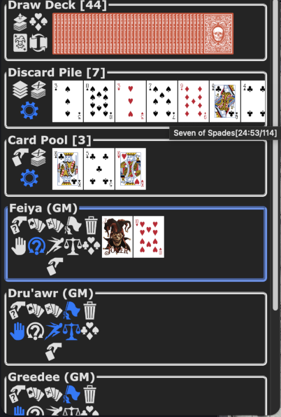
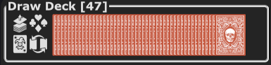
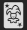
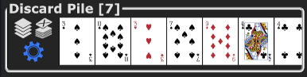
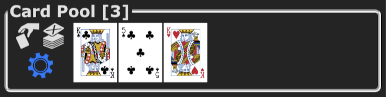

A card-based initiative tracker extension Savage Worlds Adventure Edition(SWADE) fans using [Owlbear Rodeo](https://owlbear-rodeo.com/), designed specifically for the Savage Worlds initative system using Action Cards.

## Overview

This extension implements the Savage Worlds initiative system with Action Cards using a standard deck of 52 playing cards plus 2 or 4 jokers. Players draw Action Cards to determine their initiative order, with various edges and hindrances affecting how cards are drawn and played.

## Getting Started

### Installation

1. Install the extension from the manifest at <https://swit-beryl.vercel.app/manifest.json>
2. Open your Owlbear Rodeo scene
3. Click the Savage Worlds Initiative icon  in the toolbar to open the tracker

### Adding Characters to Initiative

Right-click on character tokens in your scene and select "Add to Initiative" from the context menu.

Characters will appear in the initiative tracker with their own card hands and control buttons.

If the character token is already in the initiative tracker, when right clicking on a token will show "Remove from Initiative"

Clicking on this in the context menu will remove that character's hand from the tracker completely.

## Interface Overview

The extension displays several sections:

### Draw Deck

The main deck of cards used for initiative. Always visible to all players and the GM.

- **Card Count**: Shows number of cards remaining in the Draw Deck
- **Buttons**:
  - **Deal Action Cards**: Deals Action Cards to all active players
  - **Deal Interlude Cards**: Deals Interlude for storytelling (DM-initiated)
  - **Use Four Jokers**: Toggle between 54-card deck (2 jokers) and 56-card deck (4 jokers), resets Draw Deck and shuffles
  - **Change Back**: Cycle through different card back designs (solely cosmetic)

### Discard Pile

Cards that have been played or discarded. Always visible to the GM; but GM can choose to show to players if desired.

- **Card Count**: Shows number of discarded cards
- **Buttons** (GM Only):
  - **Shuffle**: Return all cards to draw deck and shuffle the deck
  - **Discard All Hands**: Force all players to discard their current hands
  - **Toggle Discard Pile Visibility**: Show/hide the discard pile to/from players

### Card Pool

A shared pool of cards for special situations. Primarily for GM use.

- **Card Count**: Shows number of cards in Card Pool
- **Buttons** (GM Only):
  - **Deal a Card to Pool**: Draw one card face-up to the pool
  - **Discard Card Pool**: Move all pool cards to discard pile
  - **Toggle Card Pool Visibility**: Show/hide the card pool to/from players

### Player Sections

Each character added to the initiative tracker has their own section showing:

- **Player Name**: Character name and player name
- **Card Hand**: Current Action or Interlude cards (face-up)
- **Initiative Order**: Players are automatically sorted by their best card for initiative

#### Player Control Buttons

##### Available to Players

- **Draw a Card**: Draw a single card to your hand
- **Discard Hand**: Discard all cards in your hand
- **Out of Combat**: Remove yourself from initiative order (discards hand)
- **Remove Player**: Remove character from initiative tracking
- **On Hold**: Temporarily pause your initiative (card remains but you're skipped)
- **Interludes**: Open popup showing storytelling suggestions based on your interlude card's suit
- **Pass Cards**: Pass selected cards to this hand (only on other players hands, GM can pass selected cards to any hand)

##### Edge/Hindrance Buttons

- **Hesitant Hindrance**: Forces you to act on your lowest value card rather than highest
- **Quick Edge**: Draw additional cards until you get one above 5
- **Level Headed Edge**: Draw extra cards at start of round, defaults to highest, but can be selected to use a different card for initiative order
  - Single click: Level Headed (draw 2 cards)
  - Double click: Improved Level Headed (draw 3 cards)
- **Tactician Edge**: Draw extra cards at start of round that can be passed to allies
  - Single click: Tactician (draw 1 card)
  - Double click: Master Tactician (draw 2 cards)

##### GM-Only Buttons

- **Draw Hand**: Deal initiative cards to this specific player

## How Initiative Works

1. **Setup**: GM and players adds characters to initiative using the context menu
2. **Deal Cards**: GM clicks "Deal Action Cards" to give each player their initiative cards
3. **Apply Edges**: Players/GM activate relevant edges (Level Headed, Quick, Tactician, etc.) for their character(s)
4. **Turn Order**: Players/GM act in order from highest(top) to lowest card
5. **End of Turn**: Players/GM discards hand at the end of turn, initiative list updates with next player at top
6. **Resolution**: After all characters act, GM can shuffle discard pile back into draw deck
7. **Repeat**: Start next round of play by dealing cards as needed

### Player States and Initiative Order

- **Active Players**: Players with Action Cards participate normally in turn order
- **On Hold**: Players marked "On Hold" skip drawing new Action Cards but retain any existing cards, acting by interrupting play, possibly by winning an opposed roll by current acting character
- **Out of Combat**: Players marked "Out of Combat" skip acting this round and have no cards
- **Hesitant**: Players with the Hesitant hindrance always act on their lowest Action Card, unless they have a Joker which works as normal allowing them to take their turn at any time in the round

## Special Rules

### Jokers

When a Joker is drawn:

- Issue Bennies to all players immediately
- The Joker acts at any time in the round they choose (no opposed roll interruption needed)
- Shuffle the deck at the end of the round

### Edges and Hindrances

#### Level Headed

- Dealt an extra Action Card, chooses which to act on
- Improved Level Headed: Dealt three Action Cards, chooses which to act on

#### Quick

- Dealt additional cards until getting one above 5
- Acts on the highest card drawn

#### Hesitant

- Lowest card determines turn order among characters

#### Tactician

- Dealt an extra Action Card that can be given to an ally (outline in gold)
- Master Tactician: Dealt two extra Action Cards that can be given to allies

These extra cards are not part of the player's Action Cards hand and have zero effect unless they are passed to another  character's whereby they can participate in finding that characters initiative order.

### Interludes

Interludes are DM-initiated storytelling opportunities that occur at the GM's discretion, usually during downtime. When the GM deals interlude cards, players receive cards that suggest story topics for developing their characters. The cards are used purely for narrative purposes and players can tell their narrative in any order or choose not to participate. Good stories should be rewarded with a bennie from the GM.

Players can click the **Interludes** button to see suggested topics based on their card's suit:

- **Hearts**: Social interactions, gathering information
- **Diamonds**: Acquiring resources, shopping
- **Clubs**: Crafting, repairing equipment
- **Spades**: Training, learning new skills

## Troubleshooting

### Cards Not Appearing

- Ensure you're in an active Owlbear Rodeo scene
- Check that the extension is properly loaded

### Players Not in Order

- Initiative order updates automatically based on card values
- Players with "On Hold" or "Out of Combat" are skipped during new card draws but may retain cards from previous rounds that affect sorting

### Missing Buttons

- Some buttons are GM-only and won't appear for regular players
- Owner-only buttons require you to have added the character token to the tracker

## Technical Notes

- Card data is compressed and stored in room metadata
- Supports up to 56 cards (52 + 2 or 4 jokers)
- Real-time synchronization across all players in the room

## Acknowledgements

This project acknowledges the following:

- **Savage Worlds Adventure Edition** by [Pinnacle Entertainment Group](https://www.peginc.com/)
- **Savaged.com** by [savaged.us](https://savaged.us/) for the original concept that inspired this Owlbear Rodeo extension.
- **Game Icons** from <https://game-icons.net/> for the icon assets used in the interface.

## Support

For issues or questions, please contact the developer or check the Owlbear Rodeo community forums.
